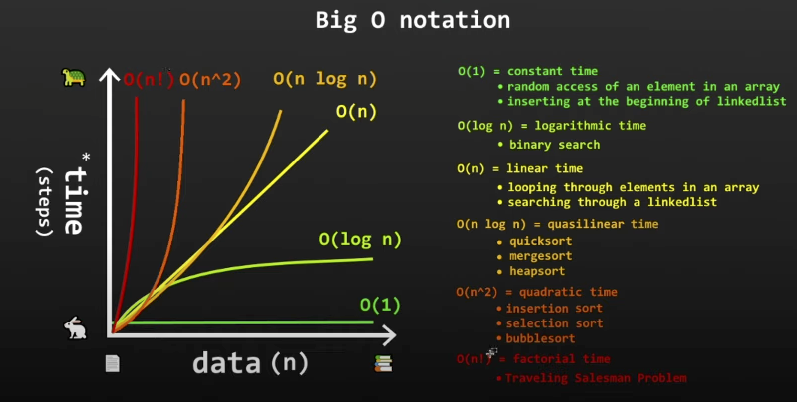

# 🚀 Algorithms & Data Structures Repository

A comprehensive collection of fundamental algorithms, data structures, and design patterns implemented in Python and TypeScript. Perfect for learning, interviews, and reference.


---

## 📚 Table of Contents

- [Sorting Algorithms](#-sorting-algorithms)
- [Searching Algorithms](#-searching-algorithms)
- [Graph Algorithms](#-graph-algorithms)
- [String Algorithms](#-string-algorithms)
- [Optimization Algorithms](#-optimization-algorithms)
- [Data Structures](#-data-structures)
- [Design Patterns](#-design-patterns)
- [CS Concepts](#-cs-concepts)
- [Big O Notation](#-big-o-notation)

---

## 🔄 Sorting Algorithms

Sorting algorithms arrange elements in a specific order. Here's a visual comparison:

```
Input: [64, 34, 25, 12, 22, 11, 90]

Bubble Sort:    [64,34,25,12,22,11,90] → Compare & swap adjacent elements
                [34,64,25,12,22,11,90] → Repeat until sorted
                ...
                [11,12,22,25,34,64,90] ✓

Quick Sort:     [64,34,25,12,22,11,90]
                ↓ Pick pivot (64)
                [34,25,12,22,11] | 64 | [90]
                ↓ Recursively sort
                [11,12,22,25,34] | 64 | [90] ✓
```

### Complexity Comparison

| Algorithm | Best | Average | Worst | Space | Stable | File |
|-----------|------|---------|-------|-------|--------|------|
| **Bubble Sort** | O(n) | O(n²) | O(n²) | O(1) | ✅ | [`bubble_sort.py`](Algorithms/bubble_sort.py) |
| **Selection Sort** | O(n²) | O(n²) | O(n²) | O(1) | ❌ | [`selection_sort.py`](Algorithms/selection_sort.py) |
| **Insertion Sort** | O(n) | O(n²) | O(n²) | O(1) | ✅ | [`insertion_sort.py`](Algorithms/insertion_sort.py) |
| **Merge Sort** | O(n log n) | O(n log n) | O(n log n) | O(n) | ✅ | [`merge_sort.py`](Algorithms/merge_sort.py) |
| **Quick Sort** | O(n log n) | O(n log n) | O(n²) | O(log n) | ❌ | [`quick_sort.py`](Algorithms/quick_sort.py) |
| **Heap Sort** | O(n log n) | O(n log n) | O(n log n) | O(1) | ❌ | [`heap_sort.py`](Algorithms/heap_sort.py) |
| **Counting Sort** | O(n+k) | O(n+k) | O(n+k) | O(k) | ✅ | [`counting_sort.py`](Algorithms/counting_sort.py) |
| **Radix Sort** | O(d(n+k)) | O(d(n+k)) | O(d(n+k)) | O(n+k) | ✅ | [`radix_sort.py`](Algorithms/radix_sort.py) |
| **Bucket Sort** | O(n+k) | O(n+k) | O(n²) | O(n+k) | ✅ | [`bucket_sort.py`](Algorithms/bucket_sort.py) |
| **Shell Sort** | O(n log n) | O(n^1.5) | O(n²) | O(1) | ❌ | [`shell_sort.py`](Algorithms/shell_sort.py) |
| **Comb Sort** | O(n log n) | O(n²/2^p) | O(n²) | O(1) | ❌ | [`comb_sort.py`](Algorithms/comb_sort.py) |
| **Intro Sort** | O(n log n) | O(n log n) | O(n log n) | O(log n) | ❌ | [`intro_sort.py`](Algorithms/intro_sort.py) |

### Visual: Merge Sort Process

```
                    [64, 34, 25, 12, 22, 11, 90]
                           /              \
                  [64, 34, 25, 12]    [22, 11, 90]
                     /        \          /      \
              [64, 34]  [25, 12]   [22, 11]  [90]
               /   \     /   \      /   \      |
            [64]  [34] [25] [12] [22] [11]   [90]
               \   /     \   /      \   /      |
              [34, 64] [12, 25]  [11, 22]    [90]
                 \      /          \      /
              [12, 25, 34, 64]  [11, 22, 90]
                     \              /
              [11, 12, 22, 25, 34, 64, 90] ✓
```

---

## 🔍 Searching Algorithms

### Linear vs Binary Search

```
Linear Search:  [1, 3, 5, 7, 9, 11, 13]  Find: 7
                ↑  ↑  ↑  ↑  ✓ Found at index 3
                O(n) - checks each element

Binary Search:  [1, 3, 5, 7, 9, 11, 13]  Find: 7
                ↑      ↑      ↑
                low   mid    high
                [1,3,5,7] ← 7 is here
                [5,7] ← 7 is here
                [7] ✓ Found!
                O(log n) - halves search space
```

| Algorithm | Best | Average | Worst | Space | File |
|-----------|------|---------|-------|-------|------|
| **Linear Search** | O(1) | O(n) | O(n) | O(1) | [`linear_search.py`](Algorithms/linear_search.py) |
| **Binary Search** | O(1) | O(log n) | O(log n) | O(1) | [`binary_search.py`](Algorithms/binary_search.py) |
| **Breadth-First Search** | O(V+E) | O(V+E) | O(V+E) | O(V) | [`breadth_first_search.py`](Algorithms/breadth_first_search.py) |
| **Depth-First Search** | O(V+E) | O(V+E) | O(V+E) | O(V) | [`depth_first_search.py`](Algorithms/depth_first_search.py) |
| **A\* Search** | O(b^d) | O(b^d) | O(b^d) | O(b^d) | [`a_star.py`](Algorithms/a_star.py) |
| **Iterative Deepening** | O(b^d) | O(b^d) | O(b^d) | O(bd) | [`iterative_deepening_search.py`](Algorithms/iterative_deepening_search.py) |
| **Uniform Cost Search** | O((V+E)log V) | O((V+E)log V) | O((V+E)log V) | O(V) | [`uniform_cost_search.py`](Algorithms/uniform_cost_search.py) |

### Graph Traversal Visualization

```
BFS (Level by level):        DFS (Deep first):
        A                            A
       / \                          / \
      B   C                        B   C
     / \   \                      /   / \
    D   E   F                    D   E   F

BFS Order: A → B → C → D → E → F
DFS Order: A → B → D → E → C → F
```

---

## 🕸️ Graph Algorithms

### Shortest Path Algorithms

```
Graph:        Dijkstra's (from A):      Bellman-Ford (from A):
   A─4─B          A: 0                    A: 0
   │   │          B: 4                    B: 4
   2   5          C: 2                    C: 2
   │   │          D: 9                    D: 9
   C─1─D          E: 12                   E: 12
    \ /
     10
      E
```

| Algorithm | Time Complexity | Space | Handles Negative Weights | File |
|-----------|----------------|-------|-------------------------|------|
| **Dijkstra's** | O((V+E) log V) | O(V) | ❌ | [`dijkstra.py`](Algorithms/dijkstra.py) |
| **Bellman-Ford** | O(VE) | O(V) | ✅ | [`bellman_ford.py`](Algorithms/bellman_ford.py) |
| **Floyd-Warshall** | O(V³) | O(V²) | ✅ | [`floyd_warshall.py`](Algorithms/floyd_warshall.py) |
| **A\*** | O(b^d) | O(b^d) | ❌ | [`a_star.py`](Algorithms/a_star.py) |

### Minimum Spanning Tree

```
Original Graph:          Kruskal's MST:        Prim's MST:
   A─4─B                    A─4─B                A─4─B
   │\ │\                   │   │                │   │
   2│ ││5                  2   │5               2   │5
   │ \││                   │   │                │   │
   C─1─D                   C─1─D                C─1─D
    \ /                      \ /                  \ /
     10                       10                   10
      E                        E                    E
```

| Algorithm | Time Complexity | File |
|-----------|----------------|------|
| **Kruskal's MST** | O(E log E) | [`kruskal_mst.py`](Algorithms/kruskal_mst.py) |
| **Prim's MST** | O(E log V) | [`prim_mst.py`](Algorithms/prim_mst.py) |

### Other Graph Algorithms

- **Connected Components** - [`connected_components.py`](Algorithms/connected_components.py)
- **Graph Coloring** - [`graph_coloring.py`](Algorithms/graph_coloring.py)
- **Topological Sort** - [`topological_sort.py`](Algorithms/topological_sort.py)
- **Max Flow / Min Cut** - [`max_flow_min_cut.py`](Algorithms/max_flow_min_cut.py)

---

## 🔤 String Algorithms

### String Matching Visualization

```
Text:    "ABABDABACDABABCABCAB"
Pattern: "ABABCABAB"

KMP:     Uses failure function to skip characters
         ABABCABAB
         └─┘ (match prefix "AB")
         On mismatch, skip to next possible match

Rabin-Karp: Uses rolling hash
            Hash(pattern) = hash("ABABCABAB")
            Compare hash of each substring
            If hash matches, verify actual match
```

| Algorithm | Time Complexity | Space | File |
|-----------|----------------|-------|------|
| **KMP** | O(n + m) | O(m) | [`kmp_string_matching.py`](Algorithms/kmp_string_matching.py) |
| **Rabin-Karp** | O(n + m) avg, O(nm) worst | O(1) | [`rabin_karp.py`](Algorithms/rabin_karp.py) |

---

## 🎯 Optimization Algorithms

### Simulated Annealing Process

```
Temperature: 1000° → 500° → 250° → 125° → ...
              ↓       ↓      ↓      ↓
Acceptance:  High → Medium → Low → Very Low
              ↓       ↓      ↓      ↓
Exploration: Wide → Narrow → Fine → Local
```

| Algorithm | Use Case | File |
|-----------|----------|------|
| **Simulated Annealing** | Global optimization, TSP | [`simulated_annealing.py`](Algorithms/simulated_annealing.py) |
| **Hill Climbing** | Local optimization | [`hill_climbing.py`](Algorithms/hill_climbing.py) |
| **Genetic Algorithm** | Evolutionary optimization | [`GeneticAlgorithm.py`](Algorithms/GeneticAlgorithm.py) |

---

## 📊 Data Structures

### Visual Comparison

```
Array:        [1, 2, 3, 4, 5]
              O(1) access, O(n) insert/delete

Linked List:  1 → 2 → 3 → 4 → 5
              O(n) access, O(1) insert/delete

Stack:        [Top] 3
                ↓   2
                ↓   1
              LIFO (Last In, First Out)

Queue:        1 → 2 → 3 → [Front]
              FIFO (First In, First Out)

Binary Tree:       5
                  / \
                 3   7
                / \ / \
               2  4 6  8

Hash Table:   Key → Hash → Index → Value
              "apple" → hash → 3 → "red"
              O(1) average lookup
```

### Complexity Table

| Data Structure | Access | Search | Insert | Delete | File |
|----------------|--------|--------|--------|--------|------|
| **Array** | O(1) | O(n) | O(n) | O(n) | [`array.py`](Data%20Structures/array.py) |
| **Linked List** | O(n) | O(n) | O(1) | O(1) | [`linked_list.py`](Data%20Structures/linked_list.py) |
| **Stack** | O(1) | O(n) | O(1) | O(1) | [`stack.py`](Data%20Structures/stack.py) |
| **Queue** | O(1) | O(n) | O(1) | O(1) | [`queue.py`](Data%20Structures/queue.py) |
| **Binary Tree** | O(n) | O(n) | O(n) | O(n) | [`binary_tree.py`](Data%20Structures/binary_tree.py) |
| **BST** | O(log n) | O(log n) | O(log n) | O(log n) | [`binary_search_tree.py`](Data%20Structures/binary_search_tree.py) |
| **Heap** | O(1) | O(n) | O(log n) | O(log n) | [`heap.py`](Data%20Structures/heap.py) |
| **Hash Table** | O(1) | O(1) | O(1) | O(1) | [`hash_table.py`](Data%20Structures/hash_table.py) |
| **Trie** | O(m) | O(m) | O(m) | O(m) | [`trie.py`](Data%20Structures/trie.py) |
| **Graph** | O(V+E) | O(V+E) | O(1) | O(V+E) | [`graph.py`](Data%20Structures/graph.py) |

---

## 🎨 Design Patterns

### Pattern Categories

```
Creational Patterns          Structural Patterns         Behavioral Patterns
──────────────────          ──────────────────         ──────────────────
┌─────────────┐             ┌─────────────┐            ┌─────────────┐
│  Singleton  │             │   Adapter   │            │  Observer   │
│  Factory    │             │  Decorator  │            │  Strategy   │
│  Builder    │             │   Facade    │            │  Command    │
│  Prototype  │             │   Proxy     │            │  Iterator   │
│Abstract Fact│             │   Bridge    │            │   State     │
│             │             │  Composite  │            │  Visitor    │
│             │             │  Flyweight  │            │  Mediator   │
└─────────────┘             └─────────────┘            │  Memento    │
                                                       │  Template   │
                                                       │  Chain of   │
                                                       │Responsibility│
                                                       └─────────────┘
```

### Quick Reference

| Pattern | Purpose | File |
|---------|---------|------|
| **Singleton** | Single instance | [`singleton.py`](Design%20Patterns/Creational%20Patterns/singleton.py) |
| **Factory** | Object creation | [`factory_method.py`](Design%20Patterns/Creational%20Patterns/factory_method.py) |
| **Observer** | Event notification | [`observer.py`](Design%20Patterns/Behavioral%20Patterns/observer.py) |
| **Strategy** | Algorithm selection | [`strategy.py`](Design%20Patterns/Behavioral%20Patterns/strategy.py) |
| **Decorator** | Add behavior dynamically | [`decorator.py`](Design%20Patterns/Structural%20Patterns/decorator.py) |

See [Design Patterns README](Design%20Patterns/README.md) for complete list.

---

## 💻 CS Concepts (TypeScript)

Modern software development concepts with TypeScript examples:

```
┌─────────────────────────────────────────┐
│  TypeScript Concepts                    │
├─────────────────────────────────────────┤
│  ✓ Interfaces & Types                   │
│  ✓ Generics & Constraints               │
│  ✓ Async/Await & Promises               │
│  ✓ Functional Programming               │
│  ✓ Type Guards & Utilities              │
│  ✓ Design Patterns in TS                │
└─────────────────────────────────────────┘
```

- **Interfaces** - [`interfaces.ts`](CS%20Concepts/interfaces.ts)
- **Types & Generics** - [`types_and_generics.ts`](CS%20Concepts/types_and_generics.ts)
- **Async/Promises** - [`async_promises.ts`](CS%20Concepts/async_promises.ts)
- **Functional Programming** - [`functional_programming.ts`](CS%20Concepts/functional_programming.ts)
- **Type Guards** - [`type_guards_and_utilities.ts`](CS%20Concepts/type_guards_and_utilities.ts)
- **Design Patterns** - [`design_patterns_typescript.ts`](CS%20Concepts/design_patterns_typescript.ts)

See [CS Concepts README](CS%20Concepts/README.md) for details.

---

## 📈 Big O Notation

Understanding algorithm efficiency:

```
Complexity    Name          Example Operations
─────────────────────────────────────────────────
O(1)          Constant      Array access, hash lookup
O(log n)      Logarithmic   Binary search, tree operations
O(n)          Linear        Linear search, array iteration
O(n log n)    Linearithmic  Merge sort, heap sort
O(n²)         Quadratic     Bubble sort, nested loops
O(2ⁿ)         Exponential   Recursive Fibonacci
O(n!)         Factorial     Permutations
```

### Visual Complexity Comparison

```
Operations
    │
    │  O(n!)
    │   ╱
    │  ╱
    │ ╱ O(2ⁿ)
    │╱
    ├───── O(n²)
    │  ╲
    │   ╲ O(n log n)
    │    ╲
    │     ╲ O(n)
    │      ╲
    │       ╲ O(log n)
    │        ╲
    │         ╲ O(1)
    └──────────┴──────────→ Input Size
```



**Resources:**
- [Big O Notation (Wikipedia)](https://en.wikipedia.org/wiki/Big_O_notation)
- [Learn Big O in 6 Minutes (Video)](https://www.youtube.com/watch?v=XMUe3zFhM5c)

---

## 🧮 Other Algorithms

### Mathematical & Utility Algorithms

- **Fibonacci** - [`fibonacci.py`](Algorithms/fibonacci.py) - Multiple implementations (recursive, iterative, memoized)
- **GCD/LCM** - [`gcd_lcm.py`](Algorithms/gcd_lcm.py) - Euclidean algorithm
- **Sieve of Eratosthenes** - [`sieve_of_eratosthenes.py`](Algorithms/sieve_of_eratosthenes.py) - Prime number generation
- **Integer Partition** - [`integer_partition.py`](Algorithms/integer_partition.py) - Combinatorics
- **Caesar Cipher** - [`caesar_cipher.py`](Algorithms/caesar_cipher.py) - Basic encryption

### Advanced Algorithms

- **Union-Find** - [`union_find.py`](Algorithms/union_find.py) - Disjoint set union
- **Page Rank** - [`page_rank.ipynb`](Algorithms/page_rank.ipynb) - Web page ranking
- **Catalan Numbers** - [`calatan_numbers.ipynb`](Algorithms/calatan_numbers.ipynb) - Combinatorial sequence

---

## 📖 How to Use

### Running Python Algorithms

```bash
# Run any algorithm file
python Algorithms/bubble_sort.py

# Or import in your code
from Algorithms.bubble_sort import bubble_sort

arr = [64, 34, 25, 12, 22, 11, 90]
bubble_sort(arr)
print(arr)  # [11, 12, 22, 25, 34, 64, 90]
```

### Using TypeScript Concepts

```bash
# Install TypeScript
npm install -g typescript

# Compile TypeScript files
tsc CS\ Concepts/interfaces.ts

# Or use with a bundler
```

### Using Data Structures

```python
from Data_Structures.linked_list import LinkedList

ll = LinkedList()
ll.append(1)
ll.append(2)
ll.append(3)
print(ll)  # 1 -> 2 -> 3
```

---

## 🎯 Learning Path

### Beginner
1. Start with **Linear Search** and **Bubble Sort**
2. Learn **Arrays** and **Linked Lists**
3. Understand **Stack** and **Queue**

### Intermediate
1. Master **Binary Search** and **Quick Sort**
2. Learn **Trees** and **Hash Tables**
3. Study **BFS** and **DFS**

### Advanced
1. Implement **Graph Algorithms** (Dijkstra, MST)
2. Master **Dynamic Programming**
3. Study **Design Patterns**

---

## 📚 Additional Resources

- [Bit Manipulation Guide](https://realpython.com/python-bitwise-operators/)
- [Algorithms Study Cheatsheet](https://www.techinterviewhandbook.org/algorithms/study-cheatsheet/)
- [TypeScript Handbook](https://www.typescriptlang.org/docs/handbook/intro.html)
- [Visual Algorithm Animations](https://visualgo.net/)

---

## 🤝 Contributing

Contributions are welcome! Please ensure:
- Code follows existing style
- Includes proper documentation
- Has example usage
- Time/space complexity noted

---

## 📄 License

This project is licensed under the MIT License - see the [LICENSE](LICENSE) file for details.

---

## ⭐ Star History

If you find this repository helpful, please consider giving it a star! ⭐

---

**Happy Coding! 🚀**
